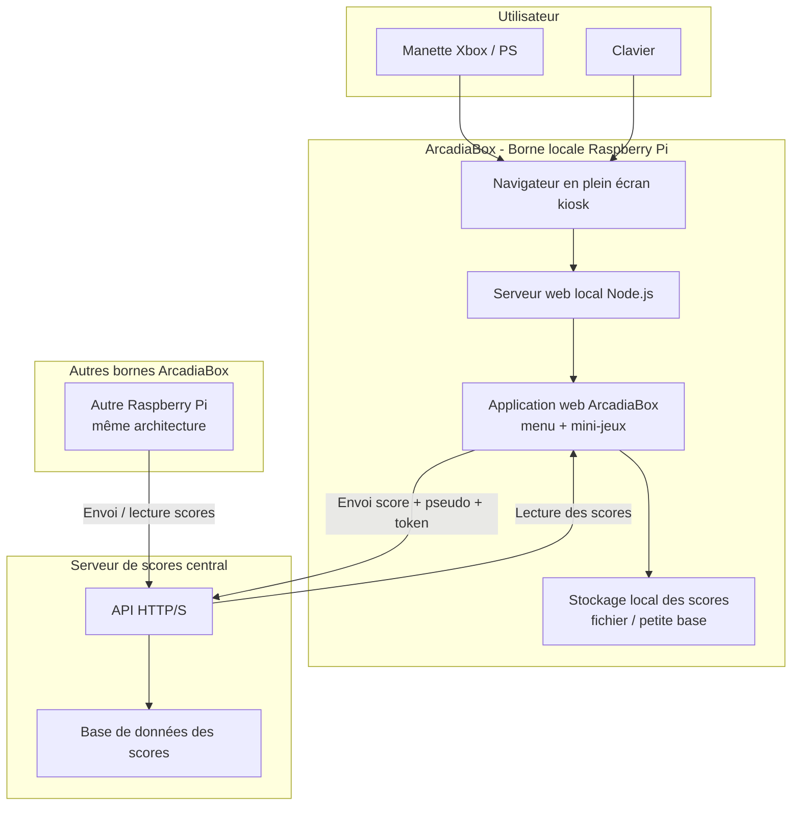
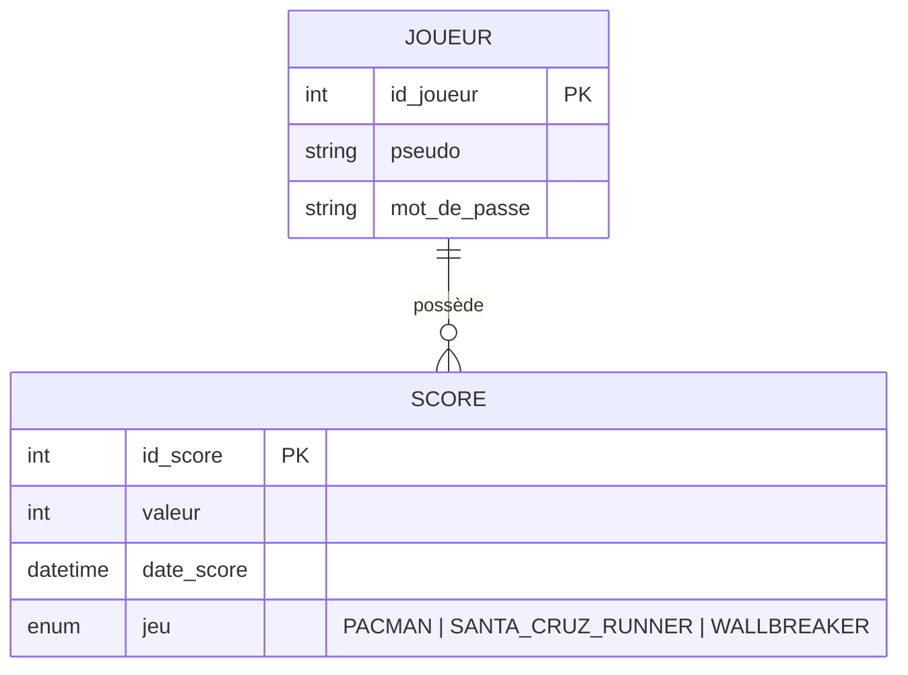
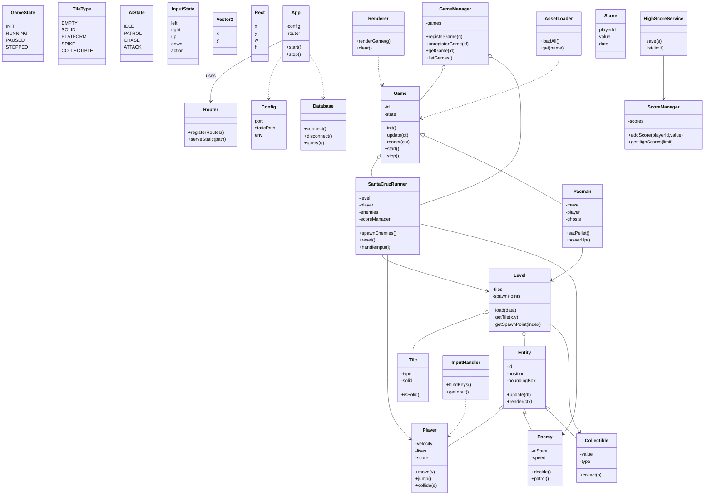

# Doc

| **Informaticien/-ne CFC**
Travail pratique individuel 2025 (TPI) |  |
| --- | --- |
|  |  |

**Modèle de rapport v1.4**

**Nom du candidat 1 :** Hertig Axelle

**Nom du candidat 2 :** Romanens Noé

**Nom du candidat 3 :** Da Silva Diogo

**Nom du candidat 4** : Gremaud Valentin

**Nom du projet :** ArcadiaBox

### Sommaire

# 1 Les grandes lignes du projet

## 1.1 Analyse de la situation initiale

Par exemple pourquoi le projet est lancé ? problème -> opportunité ? Reprendre des éléments du business case.

Il manque une solution simple et rapide pour proposer des jeux accessibles à tous dans les écoles, entreprises ou lieux publics. Les solutions actuelles ne permettent pas toujours un accès immédiat ou une utilisation intuitive.

Le projet vise donc à créer une borne d’arcade moderne, facile à utiliser par n’importe qui, compatible manette et clavier, accessible depuis un navigateur sans installation et offrant une expérience ludique immédiate pour tout type d’utilisateur.

## 1.2 Analyse de l’état désiré

Dans l’état désiré, ArcadiaBox doit offrir une expérience de jeu **simple, rapide et accessible** à n’importe quel utilisateur, sans installation et sans connaissances techniques. Le système final doit permettre :

### **Utilisation immédiate**

- La borne doit être prête à l’emploi dès son démarrage.
- L’accès se fait depuis un navigateur moderne via le réseau local, sans installation supplémentaire.

### **Navigation intuitive**

- Une interface claire, lisible permettant à un joueur de trouver un mini-jeu rapidement.
- Contrôle possible avec une manette Xbox ou un clavier, sans configuration.

### **Expérience de jeu fluide**

- Les trois mini-jeux doivent être jouables immédiatement.
- Les performances doivent rester stables (50 FPS) sur Raspberry Pi 4.
- Aucun freeze, bug bloquant ou lenteur importante.

### **Fonctionnalités arcade essentielles**

- Lancement d’une partie en moins de 10 secondes.
- Tableau des scores visible par les joueurs.
- Réinitialisation des scores via une interface simple pour l’administrateur.
- Mode plein écran pour améliorer l’immersion.
- Mode attract (animation automatique) lorsque la borne est inactive, afin d’attirer l’attention.

### **Système facile à déployer**

- Le Raspberry Pi doit héberger toute l’application.
- Le système doit être facilement réutilisable dans d’autres écoles, entreprises ou événements.

### **Expérience similaire pour tous les utilisateurs**

- Le système doit être accessible pour des enfants comme pour des adultes.
- La prise en main doit être possible en moins de 2 minutes, même pour des personnes non techniques.

## 1.3 Cahier des charges / exigences du système

### 1.3.1 Analyse

Voici les différentes tâches exigées durant la phase d’analyse :

- Recueil des besoins du client (kickoff, questions, clarifications).
- Analyse du contexte d’utilisation : bornes en écoles et entreprises, usage simple et rapide.
- Définition des objectifs SMART du projet.
- Identification des acteurs.
- Rédaction des **User Stories**.
- Définition du périmètre fonctionnel et non-fonctionnel.
- Analyse des contraintes : Raspberry Pi, Gamepad API, performances, dépendance réseau.
- Élaboration de la matrice des risques.
- Étude des différentes variantes d’architecture (serveur local, serveur centralisé).
- Validation avec le client : choix final des jeux, fonctionnement offline/online, mode attract v3, compatibilité manettes.

### 1.3.2 Conception

Voici les différentes tâches exigées durant la phase de conception

- Conception de l’architecture technique finale :
    
    **1 Raspberry Pi par borne → fait office de serveur local et d’affichage + synchronisation scores en ligne.**
    
- Choix des technologies :
    
    Alpine.js (UI), Phaser (jeux), Node.js (backend scores), API externe.
    
- Conception des maquettes UI (menu, sélection de jeux, tableau des scores).
- Élaboration des **diagrammes UML** :
    - Diagramme de cas d’utilisation
    - Diagrammes d’activités
    - Diagramme d’architecture du système
- Définition du modèle de données (scores en ligne).
- Conception du routing client (navigation menu → jeu → scores).
- Conception de l’intégration des périphériques (manettes + clavier).
- Conception du mode kiosk (lancement auto du navigateur plein écran).
- Définition du protocole d’échange pour les scores :
    
    **token + signature → éviter la falsification du score.**
    

### 1.3.3 Réalisation

- Mise en place de l’environnement de développement (Node.js, Vite, Phaser, PostgreSQL).
- Développement de l’application web **ArcadiaBox** sous forme de SPA.
- Implémentation du **menu arcade** avec navigation clavier et manette.
- Développement et intégration progressive des mini-jeux :
    - Pac-Man
    - Wallbreaker
    - Santa Cruz Runner
- Intégration de la **Gamepad API** pour la gestion des manettes Xbox.
- Gestion du mode attract après une période d’inactivité.
- Mise en place du backend Node.js :
    - API REST pour les scores
    - gestion de l’authentification (JWT)
    - validation et stockage sécurisé des scores
- Implémentation de la persistance des données via PostgreSQL.
- Configuration du Raspberry Pi :
    - choix de l’OS (Raspberry Pi OS Desktop)
    - installation des dépendances
    - optimisation des performances graphiques
- Configuration du **lancement automatique** de l’application en mode kiosk via Chromium.
- Tests fonctionnels :
    - navigation menu
    - lancement des jeux
    - saisie et affichage des scores
    - compatibilité clavier/manette
- Tests de performance et de fluidité sur Raspberry Pi.
- Corrections et itérations suite aux retours de tests.
- Validation finale avec le client

## 1.4 Organisation du projet

### 1.4.1 Méthodes de gestion de projet

Nous avons choisit la méthode scrum qui suit le principe AGILE.

### 1.4.2 Participants

Valentin / Product owner

Axelle / Scrum master

Noé / Développeur

Diogo / Technicien IT

### 1.4.3 Sauvegardes

nous avons sauvgarder nos fichier sur visuela studio code ainsi que sur notion

# 2 Analyse préliminaire

## 2.1 Objectifs du système

### 2.1.1 Analyse de l’état actuel

À l’heure actuelle, il n’existe pas de solution simple et clé en main permettant de proposer rapidement des mini-jeux accessibles à tous dans les écoles, entreprises ou lieux publics.
Les solutions existantes sont souvent soit trop complexes à installer, soit dépendantes de machines coûteuses comme un PC, soit peu intuitives pour tous les types d’utilisateurs.

De plus, l’absence d’une plateforme centralisée et simple limite l’utilisation de jeux comme activité ponctuelle ou animation conviviale. L’accès aux jeux nécessite généralement une installation préalable ou des connaissances techniques, ce qui freine leur adoption.

### 2.1.2 Analyse de l’état désiré

L’état désiré est la mise à disposition d’une **borne d’arcade moderne, autonome et facile à déployer**, basée sur un Raspberry Pi.

La borne doit démarrer automatiquement sur une interface de jeu accessible via un navigateur, sans installation ni configuration complexe pour l’utilisateur.

Le système doit permettre :

- une prise en main immédiate,
- l’utilisation d’une manette ou d’un clavier,
- l’affichage et la gestion des scores,
- une expérience fluide et stable sur du matériel à faible coût.

L’objectif est d’obtenir une solution fiable, intuitive et adaptable à différents contextes.

### 2.1.3 Objectifs

Les objectifs du projet, définis selon la méthode SMART, sont les suivants :

- Développer **au minimum trois mini-jeux jouables** avec une manette Xbox ou un clavier.
- Garantir un **temps de lancement d’un jeu inférieur à 10 secondes**.
- Assurer une **prise en main de l’interface en moins de 2 minutes** pour un utilisateur non technique.
- Fournir un **système de scores persistant**, avec possibilité de remise à zéro par un administrateur.
- Atteindre une **fluidité d’au moins 50 FPS** sur Raspberry Pi.
- Livrer une **version fonctionnelle complète** à l’issue des 5 semaines du projet.
- Produire une **documentation complète**.

## 2.2 Variantes

Plusieurs variantes ont été étudiées avant de retenir la solution finale :

### Variante 1 – PC et serveur web centralisé

Un serveur central héberge l’application, et plusieurs PC accèdent aux jeux via un navigateur.

→ Variante rejetée en raison du coût élevé du matériel et de la complexité de déploiement.

### Variante 2 – Raspberry Pi comme serveur uniquement

Le Raspberry Pi agit uniquement comme serveur web, accessible depuis d’autres machines sur le réseau.

→ Variante fonctionnelle, mais nécessitant un ordinateur externe par borne.

### Variante retenue – Raspberry Pi autonome par borne

Chaque borne dispose de son propre Raspberry Pi, connecté directement à un écran et fonctionnant en mode kiosk.

→ Cette variante a été retenue car elle offre :

- une indépendance totale de chaque borne
- un coût réduit
- une simplicité d’installation
- une meilleure expérience utilisateur

## 2.3 Rentabilité

Le projet ArcadiaBox repose sur des composants matériels à faible coût et des technologies open-source.

Le budget estimé par borne reste inférieur à 150 CHF, incluant le Raspberry Pi, les périphériques et les accessoires nécessaires.

La solution permet :

- de réduire les coûts par rapport à un PC classique
- d’être facilement réplicable
- de limiter les frais de maintenance

Bien que le projet n’ait pas un objectif commercial dans le cadre du module, la solution proposée est **économiquement viable** et pourrait être utilisée dans un contexte réel.

## 2.4 Analyse de risque

| **ID** | **Risque** | **Probabilité** | **Impact** | **Criticité** | **Plan d’atténuation** |
| --- | --- | --- | --- | --- | --- |
| **R1** | Retard dans la livraison du prototype | Moyenne | Élevé | Élevée | Priorisation stricte des fonctionnalités essentielles |
| **R2** | Absence d’un membre clé | Faible | Moyen | Moyenne | Documentation continue et partage des connaissances |
| **R3** | Problème de performance sur Raspberry Pi | Moyenne | Élevé | Élevée | Tests fréquents et optimisation Canvas/jeux |
| **R4** | Mauvaise compréhension des besoins client | Moyenne | Élevé | Élevée | Réunions régulières et validations intermédiaires |
| **R5** | Problèmes réseau ou dépendance Internet | Moyenne | Moyen | Moyenne | Mode dégradé et gestion des erreurs réseau |
| **R6** | Perte ou falsification des scores | Faible | Élevé | Moyenne | Vérification côté serveur, token et stockage sécurisé |

# 3 Analyse

## 3.1 Cas d’utilisation

### 3.1.1 Acteurs

[use_case_v3.pdf](attachment:fc761ad1-f2c9-4599-8a56-aeeb3ae6808d:use_case_v3.pdf)

## 3.2 Diagrammes d’activités / de séquence

### Description du flux lorsqu’un joueur veut jouer à un jeu

### Flux de remise à zéro du score par l’admin

## 3.3 Maquettes

# 4 Concept

## 4.1 Architecture du système

## 4.2 Diagramme Entité-Relation

## 4.3 Modèle relationnel de la base de données

## 4.4 Diagrammes de classes

## 4.5 Diagrammes de séquence des interactions

## 4.6 Concept de tests

### 4.6.1 Protocole de tests

| N° | Objectif (US) | Méthode | Résultat attendu | Résultat obtenu | État | Commentaires / conclusion |
| --- | --- | --- | --- | --- | --- | --- |
| 1 | US03 – Accéder à ArcadiaBox via navigateur | Ouvrir Chromium sur le Raspberry Pi ([http://localhost:3000](http://localhost:3000/)) | La page d’accueil du menu arcade s’affiche correctement, tous les éléments visibles (logo, liste des mini-jeux, boutons) |  |  |  |
| 2 | US09 / US12 – Lancer l’application en plein écran et interface responsive | Démarrer le Raspberry Pi | Chromium démarre automatiquement en plein écran et l’interface s’adapte correctement à toutes les résolutions (PC, tablette, RPi) |  |  |  |
| 3 | US02 / US04 – Naviguer dans le menu au clavier | Utiliser les flèches haut/bas pour naviguer, Entrée pour valider | Navigation fluide dans le menu, sélection possible de chaque mini-jeu |  |  |  |
| 4 | US01 / US04 – Naviguer dans le menu avec manette Xbox | Brancher la manette et naviguer avec sticks et boutons | Les actions de la manette sont reconnues correctement, toutes les touches mappées fonctionnent pour naviguer et sélectionner |  |  |  |
| 5 | US05 / US11 – Lancer Mini-jeu 1 | Depuis le menu, sélectionner Mini-jeu 1 et valider | Le jeu démarre immédiatement, tous les assets (images, sons, scripts) sont chargés correctement |  |  |  |
| 6 | US06 – Jouer à Mini-jeu 1 | Jouer 2–3 minutes, tester mouvements et actions | Jeu fluide, sans latence ni freeze, actions et collisions fonctionnent correctement |  |  |  |
| 7 | US07 / US10 – Sauvegarder score Mini-jeu 1 | Finir une partie | Le score est enregistré automatiquement dans le fichier JSON ou base de données |  |  |  |
| 8 | US05 / US11 – Lancer Mini-jeu 2 | Depuis le menu, sélectionner Mini-jeu 2 et valider | Le jeu démarre immédiatement, tous les assets sont chargés correctement |  |  |  |
| 9 | US06 – Jouer à Mini-jeu 2 | Jouer 2–3 minutes, tester mouvements et actions | Jeu fluide, sans latence ni freeze, actions et collisions fonctionnent correctement |  |  |  |
| 10 | US07 / US10 – Sauvegarder score Mini-jeu 2 | Finir une partie | Le score est enregistré automatiquement |  |  |  |
| 11 | US05 / US11 – Lancer Mini-jeu 3 | Depuis le menu, sélectionner Mini-jeu 3 et valider | Le jeu démarre immédiatement, tous les assets sont chargés correctement |  |  |  |
| 12 | US06 – Jouer à Mini-jeu 3 | Jouer 2–3 minutes, tester mouvements et actions | Jeu fluide, sans latence ni freeze, actions et collisions fonctionnent correctement |  |  |  |
| 13 | US07 / US10 – Sauvegarder score Mini-jeu 3 | Finir une partie | Le score est enregistré automatiquement |  |  |  |
| 14 | US08 / US10 – Afficher le tableau des scores | Accéder à la page “Scores” depuis le menu | Les scores de Mini-jeu 1, 2 et 3 s’affichent correctement, triés et horodatés |  |  |  |
| 15 | US09 / US10 – Redémarrage du Raspberry | Redémarrer le Raspberry Pi | L’application redémarre automatiquement, les scores précédents de tous les mini-jeux sont conservés |  |  |  |
| 16 | US03 / US12 – Comportement sans réseau | Débrancher Internet, naviguer et lancer les mini-jeux | L’application reste utilisable, les mini-jeux fonctionnent localement, interface responsive intacte |  |  |  |
| 17 | US01 / US02 – Test multi-input | Basculer entre clavier et manette pendant un mini-jeu | Les deux périphériques sont reconnus, aucune interférence, actions correctement prises en compte |  |  |  |
| 18 | US12 – Test sur différents appareils | Tester ArcadiaBox sur PC, tablette et RPi | Interface et navigation adaptées à chaque device, tous les mini-jeux jouables, fluidité conservée |  |  |  |
| 19 | US03 / US09 / US11 – Test stabilité serveur | Accéder à l’application plusieurs fois de suite | Serveur stable, assets correctement servis, pas d’erreurs ou crashs |  |  |  |

# 5 Réalisation

## 5.1 Application web ArcadiaBox

### Architecture front-end

ArcadiaBox est une SPA construite avec Vite.

Le point d’entrée `main.js` initialise les éléments principaux de l’application :

- le **store global Alpine**
- le **menu arcade**
- le **curseur personnalisé**
- le rendu dynamique du template principal

Le **store global** centralise toute la logique applicative :

- navigation entre les vues (menu, jeu, scores, aide, authentification)
- état du joueur et de la session
- score courant et mode *attract*
- détection des manettes via la **Gamepad API**
- communication avec l’API backend (authentification et scores)

Cette approche permet une gestion cohérente de l’état et évite les duplications de logique entre les composants.

### Interface arcade et services transverses

L’interface principale repose sur un template Alpine structuré autour :

- d’un **header** indiquant l’état du joueur connecté et des manettes
- d’une **grille de sélection des jeux**
- d’un **mode attract** déclenché après 60 secondes d’inactivité
- d’actions globales comme le score, le menu d’aide, l’authentification,…

La vue **Scores** affiche :

- un bandeau personnalisé
- des podiums par jeu
- un classement global des joueurs actifs

Les données sont entièrement pilotées par le store global, garantissant une synchronisation immédiate entre l’UI et l’état applicatif.

Le **GameLoader** charge les jeux à la demande grâce à des imports dynamiques.

Il gère :

- l’affichage d’une barre de progression
- le lancement et l’arrêt des jeux
- les callbacks de fin de partie et de score

La gestion des utilisateurs est assurée par le **AuthManager**, qui :

- stocke le token JWT
- gère login, register et logout
- fournit les méthodes sécurisées pour poster des scores et récupérer les classements

### Mini-jeux embarqués

Deux jeux complets ont été développés avec **Phaser**, selon une architecture de type MVC :

- **Pac-Man**
- **Wallbreaker**

Chaque jeu est structuré en scènes distinctes (*Menu*, *Game*, *GameOver*), avec une séparation claire entre logique, rendu et contrôles.

Deux prototypes supplémentaires ont été réalisés :

- **Santa Cruz Runner**
- **Pong Duel**

Ces prototypes servent de base technique pour tester la physique, les contrôles et l’intégration dans l’arcade avant l’activation complète des scores.

Les jeux communiquent avec l’application hôte via des callbacks, ce qui permet l’affichage synchronisé du score, des vies et du niveau dans les panneaux latéraux de l’interface.

### Backend et persistance

Le backend repose sur un **serveur Express** qui :

- sert le build Vite
- expose une API REST
- fournit un endpoint de *health check*
- journalise chaque requête HTTP

L’API d’authentification permet :

- l’inscription et la connexion des joueurs
- la validation des tokens JWT
- le comptage des parties jouées

La gestion des scores offre :

- des classements globaux
- des classements par jeu
- des statistiques par joueur
- une création de score sécurisée

La persistance est assurée via Prisma avec PostgreSQL, sur un schéma simple :

- `Joueur`
- `Score`

Des index ont été ajoutés afin d’optimiser les tris et les requêtes de classement.

### Industrialisation et scripts

Plusieurs scripts ont été développés pour faciliter le déploiement et le développement :

- `npm run setup`
    
    Automatise l’installation des dépendances, la génération du client Prisma et la vérification du schéma, tout en nettoyant les caches problématiques.
    
- `npm run dev:full`
    
    Vérifie les prérequis, libère les ports, lance simultanément le backend (port 8080) et Vite (port 3000), puis assure un arrêt propre des processus.
    

Ces outils permettent de reproduire rapidement un environnement fonctionnel, y compris sur un **Raspberry Pi fraîchement installé**.

## 5.2 Raspberry Pi

### Système d’exploitation

Après des essais peu concluants avec **Raspberry Pi OS Lite**, principalement dus à des **performances de rendu insuffisantes pour Phaser**, le choix s’est porté sur **Raspberry Pi OS Desktop**.

Cette version apporte :

- l’**accélération graphique** nécessaire à une expérience de jeu fluide,
- un **environnement de bureau complet**,
- un accès direct à **Chromium** sans configuration supplémentaire,
- une meilleure facilité de **dépannage local**.

Elle permet également d’exécuter les scripts Node.js sans dépendre d’un serveur d’affichage minimaliste, ce qui simplifie fortement l’exploitation de la borne.

### Lancement automatique de l’application

Afin de transformer le Raspberry Pi en **borne d’arcade clé en main**, un mécanisme de lancement automatique a été mis en place.

Un fichier

`~/.config/autostart/arcadiabox.desktop`

est exécuté au démarrage de la session graphique et lance **Chromium en mode kiosk** sur l’URL de l’application.

Le mode *kiosk* permet :

- le **plein écran forcé**,
- la **suppression de la barre d’adresse**,
- l’impossibilité d’ouvrir d’autres onglets ou de quitter l’application.

Ce choix garantit que l’utilisateur reste toujours dans l’interface ArcadiaBox et revient automatiquement sur le menu arcade après un redémarrage.

### Support matériel et contrôles

La gestion des contrôleurs repose exclusivement sur des **standards web**, sans pilote spécifique côté système.

Les **manettes Xbox** sont prises en charge via la **Gamepad API**, directement depuis le navigateur.

Le store global met à jour en continu :

- l’état de connexion/déconnexion des manettes,
- le polling des boutons et axes,
- l’affichage du statut joueur dans l’interface.

Dès qu’une interaction est détectée (manette ou clavier), le système sort automatiquement du **mode attract**, ce qui correspond aux usages typiques d’une borne d’arcade.

Cette approche permet une compatibilité immédiate avec :

- manettes USB
- clavier

sans aucune configuration supplémentaire une fois le matériel branché.

## 5.3 Descente de code

# 6 Tests

## 6.1 Procédure de test

Maintenant que la réalisation est terminée, il faut compléter le protocole de tests créé précédemment. Celui-ci comporte des tests à effectuer sur l’application cliente mais également sur Postman.

## 6.2 Protocole de tests

| N° | Objectif (US) | Méthode | Résultat attendu | Date | Résultat obtenu | État | Commentaires / conclusion |
| --- | --- | --- | --- | --- | --- | --- | --- |
| 1 | US03 – Accéder à ArcadiaBox via navigateur | Ouvrir Chromium sur le Raspberry Pi ([http://localhost:3000](http://localhost:3000/)) | La page d’accueil du menu arcade s’affiche correctement, tous les éléments visibles (logo, liste des mini-jeux, boutons) |  |  |  |  |
| 2 | US09 / US12 – Lancer l’application en plein écran et interface responsive | Démarrer le Raspberry Pi | Chromium démarre automatiquement en plein écran et l’interface s’adapte correctement à toutes les résolutions (PC, tablette, RPi) |  |  |  |  |
| 3 | US02 / US04 – Naviguer dans le menu au clavier | Utiliser les flèches haut/bas pour naviguer, Entrée pour valider | Navigation fluide dans le menu, sélection possible de chaque mini-jeu |  |  |  |  |
| 4 | US01 / US04 – Naviguer dans le menu avec manette Xbox | Brancher la manette et naviguer avec sticks et boutons | Les actions de la manette sont reconnues correctement, toutes les touches mappées fonctionnent pour naviguer et sélectionner |  |  |  |  |
| 5 | US05 / US11 – Lancer Mini-jeu 1 | Depuis le menu, sélectionner Mini-jeu 1 et valider | Le jeu démarre immédiatement, tous les assets (images, sons, scripts) sont chargés correctement | 05.01.2026 | Le jeu démarre immédiatement et tous les éléments sont chargés | ✅ | Aucun |
| 6 | US06 – Jouer à Mini-jeu 1 | Jouer 2–3 minutes, tester mouvements et actions | Jeu fluide, sans latence ni freeze, actions et collisions fonctionnent correctement | 05.01.2026 | Le jeu est fonctionnel, avec parfois de légers bugs sur les fantômes, mais cela n’empêche pas de jouer | ☑️ | Oui, le jeu est fonctionnel, mais il pourrait être amélioré, notamment pour les mouvements des fantômes, ce qui est cependant complexe à corriger |
| 7 | US07 / US10 – Sauvegarder score Mini-jeu 1 | Finir une partie | Le score est enregistré automatiquement dans le fichier JSON ou base de données | 05.01.2026 |  Le score est bien sauvegardé | ✅ | Aucun |
| 8 | US05 / US11 – Lancer Mini-jeu 2 | Depuis le menu, sélectionner Mini-jeu 2 et valider | Le jeu démarre immédiatement, tous les assets sont chargés correctement | 05.01.2026 | Le jeu démarre immédiatement et tous les éléments sont chargés | ✅ | Aucun |
| 9 | US06 – Jouer à Mini-jeu 2 | Jouer 2–3 minutes, tester mouvements et actions | Jeu fluide, sans latence ni freeze, actions et collisions fonctionnent correctement | 05.01.2026 | Le jeu démarre immédiatement et tous les éléments sont chargés | ✅ | Aucun |
| 10 | US07 / US10 – Sauvegarder score Mini-jeu 2 | Finir une partie | Le score est enregistré automatiquement |  |  |  |  |
| 11 | US05 / US11 – Lancer Mini-jeu 3 | Depuis le menu, sélectionner Mini-jeu 3 et valider | Le jeu démarre immédiatement, tous les assets sont chargés correctement |  |  |  |  |
| 12 | US06 – Jouer à Mini-jeu 3 | Jouer 2–3 minutes, tester mouvements et actions | Jeu fluide, sans latence ni freeze, actions et collisions fonctionnent correctement |  |  |  |  |
| 13 | US07 / US10 – Sauvegarder score Mini-jeu 3 | Finir une partie | Le score est enregistré automatiquement |  |  |  |  |
| 14 | US08 / US10 – Afficher le tableau des scores | Accéder à la page “Scores” depuis le menu | Les scores de Mini-jeu 1, 2 et 3 s’affichent correctement, triés et horodatés | 05.01.2026 |  Les scores sont bien affichés et triés | ✅ |  |
| 15 | US09 / US10 – Redémarrage du Raspberry | Redémarrer le Raspberry Pi | L’application redémarre automatiquement, les scores précédents de tous les mini-jeux sont conservés |  |  |  |  |
| 16 | US03 / US12 – Comportement sans réseau | Débrancher Internet, naviguer et lancer les mini-jeux | L’application reste utilisable, les mini-jeux fonctionnent localement, interface responsive intacte |  |  |  |  |
| 17 | US01 / US02 – Test multi-input | Basculer entre clavier et manette pendant un mini-jeu | Les deux périphériques sont reconnus, aucune interférence, actions correctement prises en compte |  |  |  |  |
| 18 | US12 – Test sur différents appareils | Tester ArcadiaBox sur PC, tablette et RPi | Interface et navigation adaptées à chaque device, tous les mini-jeux jouables, fluidité conservée |  |  |  |  |
| 19 | US03 / US09 / US11 – Test stabilité serveur | Accéder à l’application plusieurs fois de suite | Serveur stable, assets correctement servis, pas d’erreurs ou crashs |  |  |  |  |

# 7 Conclusion

## 7.1 Améliorations possibles

## 7.2 Auto-évaluation

## 7.3 Conclusion du module de membre1

## 7.4 Conclusion du module de membre2

## 7.5 Conclusion du module de membre3

# 8 Bibliographie : liste des sources et références

# 9 Glossaire