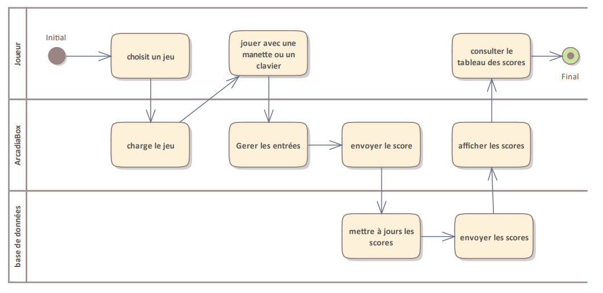
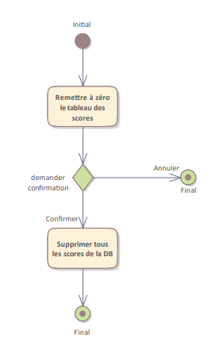
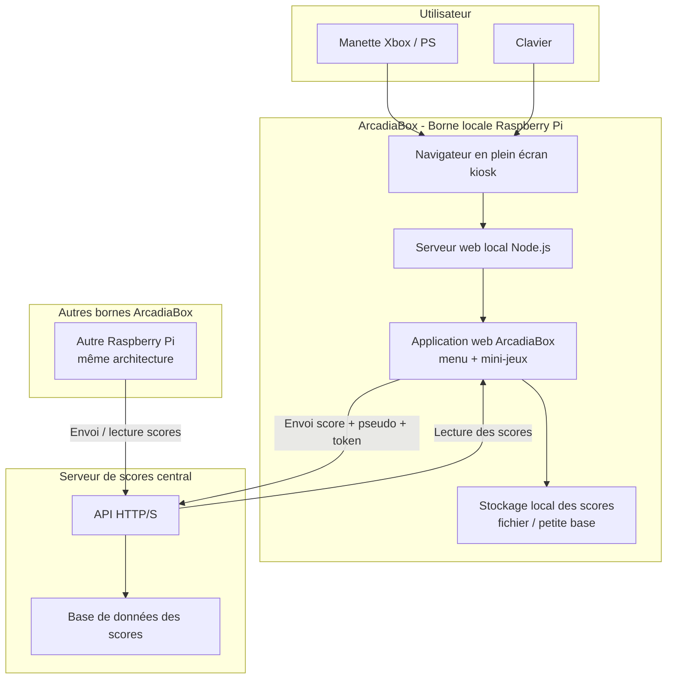
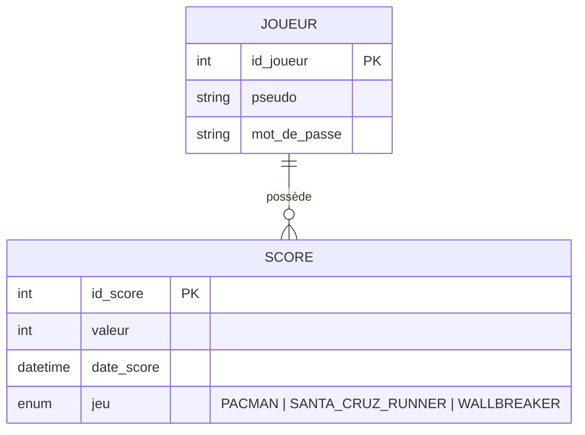
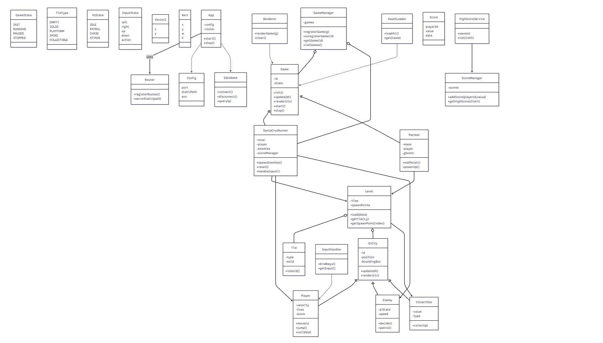

| **Informaticien/-ne CFC**

| Travail pratique individuel 2025 (TPI) |  |
| -------------------------------------- | - |
|                                        |  |

**Modèle de rapport v1.4**

**Nom du candidat 1 :** Hertig Axelle

**Nom du candidat 2 :** Romanens Noé

**Nom du candidat 3 :** Da Silva Diogo

**Nom du candidat 4** : Gremaud Valentin

**Nom du projet :** ArcadiaBox

### Sommaire

# 1 Les grandes lignes du projet

## 1.1 Analyse de la situation initiale

Par exemple pourquoi le projet est lancé ? problème -> opportunité ? Reprendre des éléments du business case.

Il manque une solution simple et rapide pour proposer des jeux accessibles à tous dans les écoles, entreprises ou lieux publics. Les solutions actuelles ne permettent pas toujours un accès immédiat ou une utilisation intuitive.

Le projet vise donc à créer une borne d’arcade moderne, facile à utiliser par n’importe qui, compatible manette et clavier, accessible depuis un navigateur sans installation et offrant une expérience ludique immédiate pour tout type d’utilisateur.

## 1.2 Analyse de l’état désiré

Dans l’état désiré, ArcadiaBox doit offrir une expérience de jeu **simple, rapide et accessible** à n’importe quel utilisateur, sans installation et sans connaissances techniques. Le système final doit permettre :

### **Utilisation immédiate**

- La borne doit être prête à l’emploi dès son démarrage.
- L’accès se fait depuis un navigateur moderne via le réseau local, sans installation supplémentaire.

### **Navigation intuitive**

- Une interface claire, lisible permettant à un joueur de trouver un mini-jeu rapidement.
- Contrôle possible avec une manette Xbox ou un clavier, sans configuration.

### **Expérience de jeu fluide**

- Les trois mini-jeux doivent être jouables immédiatement.
- Les performances doivent rester stables (50 FPS) sur Raspberry Pi 5.
- Aucun freeze, bug bloquant ou lenteur importante.

### **Fonctionnalités arcade essentielles**

- Lancement d’une partie en moins de 10 secondes.
- Tableau des scores visible par les joueurs.
- Réinitialisation des scores via une interface simple pour l’administrateur.
- Mode plein écran pour améliorer l’immersion.
- Mode attract (animation automatique) lorsque la borne est inactive, afin d’attirer l’attention.

### **Système facile à déployer**

- Le Raspberry Pi doit héberger toute l’application.
- Le système doit être facilement réutilisable dans d’autres écoles, entreprises ou événements.

### **Expérience similaire pour tous les utilisateurs**

- Le système doit être accessible pour des enfants comme pour des adultes.
- La prise en main doit être possible en moins de 2 minutes, même pour des personnes non techniques.

## 1.3 Cahier des charges / exigences du système

### 1.3.1 Analyse

Voici les différentes tâches exigées durant la phase d’analyse :

- Recueil des besoins du client (kickoff, questions, clarifications).
- Analyse du contexte d’utilisation : bornes en écoles et entreprises, usage simple et rapide.
- Définition des objectifs SMART du projet.
- Identification des acteurs.
- Rédaction des **User Stories**.
- Définition du périmètre fonctionnel et non-fonctionnel.
- Analyse des contraintes : Raspberry Pi, Gamepad API, performances, dépendance réseau.
- Élaboration de la matrice des risques.
- Étude des différentes variantes d’architecture (serveur local, serveur centralisé).
- Validation avec le client : choix final des jeux, fonctionnement offline/online, mode attract v3, compatibilité manettes.

### 1.3.2 Conception

Voici les différentes tâches exigées durant la phase de conception

- Conception de l’architecture technique finale :
  **1 Raspberry Pi par borne → fait office de serveur local et d’affichage + synchronisation scores en ligne.**
- Choix des technologies :
  Alpine.js (UI), Phaser (jeux), Node.js (backend scores), API externe.
- Conception des maquettes UI (menu, sélection de jeux, tableau des scores).
- Élaboration des **diagrammes UML** :
  - Diagramme de cas d’utilisation
  - Diagrammes d’activités
  - Diagramme d’architecture du système
- Définition du modèle de données (scores en ligne).
- Conception du routing client (navigation menu → jeu → scores).
- Conception de l’intégration des périphériques (manettes + clavier).
- Conception du mode kiosk (lancement auto du navigateur plein écran).
- Définition du protocole d’échange pour les scores :
  **token + signature → éviter la falsification du score.**

### 1.3.3 Réalisation

- Mise en place de l’environnement de développement (Node.js, Vite, Phaser, PostgreSQL).
- Développement de l’application web **ArcadiaBox** sous forme de SPA.
- Implémentation du **menu arcade** avec navigation clavier et manette.
- Développement et intégration progressive des mini-jeux :
  - Pac-Man
  - Wallbreaker
  - Santa Cruz Runner
- Intégration de la **Gamepad API** pour la gestion des manettes Xbox.
- Gestion du mode attract après une période d’inactivité.
- Mise en place du backend Node.js :
  - API REST pour les scores
  - gestion de l’authentification (JWT)
  - validation et stockage sécurisé des scores
- Implémentation de la persistance des données via PostgreSQL.
- Configuration du Raspberry Pi :
  - choix de l’OS (Raspberry Pi OS Desktop)
  - installation des dépendances
  - optimisation des performances graphiques
- Configuration du **lancement automatique** de l’application en mode kiosk via Chromium.
- Tests fonctionnels :
  - navigation menu
  - lancement des jeux
  - saisie et affichage des scores
  - compatibilité clavier/manette
- Tests de performance et de fluidité sur Raspberry Pi.
- Corrections et itérations suite aux retours de tests.
- Validation finale avec le client

## 1.4 Organisation du projet

### 1.4.1 Méthodes de gestion de projet

Nous avons choisit la méthode scrum qui suit le principe AGILE.

### 1.4.2 Participants

Valentin / Product owner

Axelle / Scrum master

Noé / Développeur

Diogo / Technicien IT

### 1.4.3 Sauvegardes

nous avons sauvgarder nos fichier sur visuela studio code ainsi que sur notion

# 2 Analyse préliminaire

## 2.1 Objectifs du système

### 2.1.1 Analyse de l’état actuel

À l’heure actuelle, il n’existe pas de solution simple et clé en main permettant de proposer rapidement des mini-jeux accessibles à tous dans les écoles, entreprises ou lieux publics.
Les solutions existantes sont souvent soit trop complexes à installer, soit dépendantes de machines coûteuses comme un PC, soit peu intuitives pour tous les types d’utilisateurs.

De plus, l’absence d’une plateforme centralisée et simple limite l’utilisation de jeux comme activité ponctuelle ou animation conviviale. L’accès aux jeux nécessite généralement une installation préalable ou des connaissances techniques, ce qui freine leur adoption.

### 2.1.2 Analyse de l’état désiré

L’état désiré est la mise à disposition d’une **borne d’arcade moderne, autonome et facile à déployer**, basée sur un Raspberry Pi.

La borne doit démarrer automatiquement sur une interface de jeu accessible via un navigateur, sans installation ni configuration complexe pour l’utilisateur.

Le système doit permettre :

- une prise en main immédiate,
- l’utilisation d’une manette ou d’un clavier,
- l’affichage et la gestion des scores,
- une expérience fluide et stable sur du matériel à faible coût.

L’objectif est d’obtenir une solution fiable, intuitive et adaptable à différents contextes.

### 2.1.3 Objectifs

Les objectifs du projet, définis selon la méthode SMART, sont les suivants :

- Développer **au minimum trois mini-jeux jouables** avec une manette Xbox ou un clavier.
- Garantir un **temps de lancement d’un jeu inférieur à 10 secondes**.
- Assurer une **prise en main de l’interface en moins de 2 minutes** pour un utilisateur non technique.
- Fournir un **système de scores persistant**, avec possibilité de remise à zéro par un administrateur.
- Atteindre une **fluidité d’au moins 50 FPS** sur Raspberry Pi.
- Livrer une **version fonctionnelle complète** à l’issue des 5 semaines du projet.
- Produire une **documentation complète**.

## 2.2 Variantes

Plusieurs variantes ont été étudiées avant de retenir la solution finale :

### Variante 1 – PC et serveur web centralisé

Un serveur central héberge l’application, et plusieurs PC accèdent aux jeux via un navigateur.

→ Variante rejetée en raison du coût élevé du matériel et de la complexité de déploiement.

### Variante 2 – Raspberry Pi comme serveur uniquement

Le Raspberry Pi agit uniquement comme serveur web, accessible depuis d’autres machines sur le réseau.

→ Variante fonctionnelle, mais nécessitant un ordinateur externe par borne.

### Variante retenue – Raspberry Pi autonome par borne

Chaque borne dispose de son propre Raspberry Pi, connecté directement à un écran et fonctionnant en mode kiosk.

→ Cette variante a été retenue car elle offre :

- une indépendance totale de chaque borne
- un coût réduit
- une simplicité d’installation
- une meilleure expérience utilisateur

## 2.3 Rentabilité

Le projet ArcadiaBox repose sur des composants matériels à faible coût et des technologies open-source.

Le budget estimé par borne reste inférieur à 150 CHF, incluant le Raspberry Pi, les périphériques et les accessoires nécessaires.

La solution permet :

- de réduire les coûts par rapport à un PC classique
- d’être facilement réplicable
- de limiter les frais de maintenance

Bien que le projet n’ait pas un objectif commercial dans le cadre du module, la solution proposée est **économiquement viable** et pourrait être utilisée dans un contexte réel.

## 2.4 Analyse de risque

| **ID** | **Risque**                           | **Probabilité** | **Impact** | **Criticité** | **Plan d’atténuation**                             |
| ------------ | ------------------------------------------ | ---------------------- | ---------------- | -------------------- | ---------------------------------------------------------- |
| **R1** | Retard dans la livraison du prototype      | Moyenne                | Élevé          | Élevée             | Priorisation stricte des fonctionnalités essentielles     |
| **R2** | Absence d’un membre clé                  | Faible                 | Moyen            | Moyenne              | Documentation continue et partage des connaissances        |
| **R3** | Problème de performance sur Raspberry Pi  | Moyenne                | Élevé          | Élevée             | Tests fréquents et optimisation Canvas/jeux               |
| **R4** | Mauvaise compréhension des besoins client | Moyenne                | Élevé          | Élevée             | Réunions régulières et validations intermédiaires      |
| **R5** | Problèmes réseau ou dépendance Internet | Moyenne                | Moyen            | Moyenne              | Mode dégradé et gestion des erreurs réseau              |
| **R6** | Perte ou falsification des scores          | Faible                 | Élevé          | Moyenne              | Vérification côté serveur, token et stockage sécurisé |

# 3 Analyse

## 3.1 Cas d’utilisation

### 3.1.1 Acteurs


## 3.2 Diagrammes d’activités / de séquence

### Description du flux lorsqu’un joueur veut jouer à un jeu



### Flux de remise à zéro du score par l’admin



## 3.3 Maquettes

# 4 Concept

## 4.1 Architecture du système



## 4.2 Diagramme Entité-Relation


## 4.3 Modèle relationnel de la base de données



## 4.4 Diagrammes de classes



## 4.5 Diagrammes de séquence des interactions


## 4.6 Concept de tests

### 4.6.1 Protocole de tests

| N° | Objectif (US)                                                                | Méthode                                                                           | Résultat attendu                                                                                                                       | Résultat obtenu | État | Commentaires / conclusion |
| --- | ---------------------------------------------------------------------------- | ---------------------------------------------------------------------------------- | --------------------------------------------------------------------------------------------------------------------------------------- | ---------------- | ----- | ------------------------- |
| 1   | US03 – Accéder à ArcadiaBox via navigateur                                | Ouvrir Chromium sur le Raspberry Pi ([http://localhost:3000](http://localhost:3000/)) | La page d’accueil du menu arcade s’affiche correctement, tous les éléments visibles (logo, liste des mini-jeux, boutons)            |                  |       |                           |
| 2   | US09 / US12 – Lancer l’application en plein écran et interface responsive | Démarrer le Raspberry Pi                                                          | Chromium démarre automatiquement en plein écran et l’interface s’adapte correctement à toutes les résolutions (PC, tablette, RPi) |                  |       |                           |
| 3   | US02 / US04 – Naviguer dans le menu au clavier                              | Utiliser les flèches haut/bas pour naviguer, Entrée pour valider                 | Navigation fluide dans le menu, sélection possible de chaque mini-jeu                                                                  |                  |       |                           |
| 4   | US01 / US04 – Naviguer dans le menu avec manette Xbox                       | Brancher la manette et naviguer avec sticks et boutons                             | Les actions de la manette sont reconnues correctement, toutes les touches mappées fonctionnent pour naviguer et sélectionner          |                  |       |                           |
| 5   | US05 / US11 – Lancer Mini-jeu 1                                             | Depuis le menu, sélectionner Mini-jeu 1 et valider                                | Le jeu démarre immédiatement, tous les assets (images, sons, scripts) sont chargés correctement                                      |                  |       |                           |
| 6   | US06 – Jouer à Mini-jeu 1                                                  | Jouer 2–3 minutes, tester mouvements et actions                                   | Jeu fluide, sans latence ni freeze, actions et collisions fonctionnent correctement                                                     |                  |       |                           |
| 7   | US07 / US10 – Sauvegarder score Mini-jeu 1                                  | Finir une partie                                                                   | Le score est enregistré automatiquement dans le fichier JSON ou base de données                                                       |                  |       |                           |
| 8   | US05 / US11 – Lancer Mini-jeu 2                                             | Depuis le menu, sélectionner Mini-jeu 2 et valider                                | Le jeu démarre immédiatement, tous les assets sont chargés correctement                                                              |                  |       |                           |
| 9   | US06 – Jouer à Mini-jeu 2                                                  | Jouer 2–3 minutes, tester mouvements et actions                                   | Jeu fluide, sans latence ni freeze, actions et collisions fonctionnent correctement                                                     |                  |       |                           |
| 10  | US07 / US10 – Sauvegarder score Mini-jeu 2                                  | Finir une partie                                                                   | Le score est enregistré automatiquement                                                                                                |                  |       |                           |
| 11  | US05 / US11 – Lancer Mini-jeu 3                                             | Depuis le menu, sélectionner Mini-jeu 3 et valider                                | Le jeu démarre immédiatement, tous les assets sont chargés correctement                                                              |                  |       |                           |
| 12  | US06 – Jouer à Mini-jeu 3                                                  | Jouer 2–3 minutes, tester mouvements et actions                                   | Jeu fluide, sans latence ni freeze, actions et collisions fonctionnent correctement                                                     |                  |       |                           |
| 13  | US07 / US10 – Sauvegarder score Mini-jeu 3                                  | Finir une partie                                                                   | Le score est enregistré automatiquement                                                                                                |                  |       |                           |
| 14  | US08 / US10 – Afficher le tableau des scores                                | Accéder à la page “Scores” depuis le menu                                      | Les scores de Mini-jeu 1, 2 et 3 s’affichent correctement, triés et horodatés                                                        |                  |       |                           |
| 15  | US09 / US10 – Redémarrage du Raspberry                                     | Redémarrer le Raspberry Pi                                                        | L’application redémarre automatiquement, les scores précédents de tous les mini-jeux sont conservés                                |                  |       |                           |
| 16  | US03 / US12 – Comportement sans réseau                                     | Débrancher Internet, naviguer et lancer les mini-jeux                             | L’application reste utilisable, les mini-jeux fonctionnent localement, interface responsive intacte                                    |                  |       |                           |
| 17  | US01 / US02 – Test multi-input                                              | Basculer entre clavier et manette pendant un mini-jeu                              | Les deux périphériques sont reconnus, aucune interférence, actions correctement prises en compte                                     |                  |       |                           |
| 18  | US12 – Test sur différents appareils                                       | Tester ArcadiaBox sur PC, tablette et RPi                                          | Interface et navigation adaptées à chaque device, tous les mini-jeux jouables, fluidité conservée                                   |                  |       |                           |
| 19  | US03 / US09 / US11 – Test stabilité serveur                                | Accéder à l’application plusieurs fois de suite                                 | Serveur stable, assets correctement servis, pas d’erreurs ou crashs                                                                    |                  |       |                           |
| 20  | Feature ajouté en plus                                                      | L’utilisateur peut configurer son avatar à la création du compte                | L’ajout de l’avatar fonctionne très bien, aucune erreur à signaler                                                                  |                  |       |                           |
| 21  | Feature ajouté en plus                                                      | L’utilisateur peut modifier son avatar après la création du profil              | La modification de l’avatar fonctionne très bien, le changement se fait facilement et de façon fluide                                |                  |       |                           |

# 5 Réalisation

## 5.1 Choix technologiques et justifications

### Stack technique retenue

| Composant        | Technologie       | Version | Justification                                                |
| ---------------- | ----------------- | ------- | ------------------------------------------------------------ |
| Build & Dev      | Vite              | 7.2.7   | Build rapide, HMR instantané, optimisé pour le dev moderne |
| UI Framework     | Alpine.js         | 3.15.2  | Ultra-léger (~15kb), réactif, parfait pour Raspberry Pi    |
| Moteur de jeux   | Phaser            | 3.90.0  | Standard 2D web, excellente performance Canvas/WebGL         |
| Backend          | Express           | 5.2.1   | Framework minimaliste, performant, grande communauté        |
| ORM              | Prisma            | 7.1.0   | Typage fort, migrations simples, client généré            |
| Base de données | PostgreSQL (Neon) | -       | Fiabilité, scalabilité, hébergement cloud managé         |
| Authentification | JWT + bcryptjs    | -       | Stateless, sécurisé, pas de session serveur                |

### Pourquoi Alpine.js plutôt que React/Vue ?

Le choix d'**Alpine.js** s'est imposé pour plusieurs raisons :

1. **Performance sur Raspberry Pi** : Alpine.js pèse ~15kb minifié contre ~45kb pour React. Sur un Raspberry Pi avec des ressources limitées, cette différence est significative.
2. **Simplicité d'intégration** : L'interface arcade ne nécessite pas de composants complexes. Alpine permet de gérer l'état directement dans le HTML avec des directives (`x-data`, `x-show`, `x-on`).
3. **Pas de transpilation JSX** : Le code reste du JavaScript natif, ce qui simplifie le debugging et réduit le temps de build.
4. **Cohabitation avec Phaser** : Les jeux Phaser gèrent leur propre rendu Canvas. Alpine ne crée pas de conflits car il ne virtualise pas le DOM.

### Pourquoi Phaser pour les jeux ?

**Phaser 3** est le moteur de jeux 2D le plus mature de l'écosystème web :

- **Abstraction hardware** : Bascule automatiquement entre WebGL et Canvas selon les capacités du device
- **Système de scènes** : Architecture MVC native avec les scènes (Menu, Game, GameOver)
- **Physique intégrée** : Arcade Physics pour les collisions et mouvements
- **Tilemap support** : Chargement natif des cartes Tiled (utilisé pour Pac-Man)
- **Gamepad API** : Support natif des manettes

### Pourquoi Prisma + PostgreSQL ?

L'alternative SQLite locale a été abandonnée car :

- **Synchronisation impossible** : Chaque borne aurait eu son propre classement isolé
- **Fiabilité** : SQLite sur carte SD Raspberry est sujet aux corruptions

PostgreSQL hébergé sur **Neon** apporte :

- **Centralisation** : Toutes les bornes partagent le même scoreboard
- **Disponibilité** : Base accessible 24/7, indépendante de l'état des bornes
- **Sauvegardes automatiques** : Gestion par Neon, sans intervention
- **Connexions sécurisées** : TLS obligatoire

## 5.2 Structure du code source

```
code/
├── src/                          # Frontend (Vite bundle)
│   ├── main.js                   # Point d'entrée
│   ├── style.css                 # Styles globaux
│   ├── core/                     # Modules applicatifs
│   │   ├── ArcadeStore.js        # Store Alpine.js global
│   │   ├── ArcadeMenu.js         # Templates et composants menu
│   │   ├── AuthManager.js        # Gestion authentification
│   │   ├── GameLoader.js         # Chargement dynamique des jeux
│   │   ├── GamepadManager.js     # API Gamepad unifiée
│   │   ├── CursorManager.js      # Curseur custom arcade
│   │   ├── AttractMode.js        # Mode démo (idle)
│   │   └── VirtualKeyboard.js    # Clavier tactile
│   └── games/                    # Mini-jeux
│       ├── pacman/               # Pac-Man (complet)
│       ├── wallbreaker/          # Wallbreaker (complet)
│       └── santa-cruz-runner/    # Runner (prototype)
│
├── server/                       # Backend Express
│   ├── index.js                  # Point d'entrée serveur
│   ├── prisma.js                 # Client Prisma initialisé
│   ├── routes/
│   │   ├── auth.js               # API authentification
│   │   └── scores.js             # API scores
│   └── generated/prisma/         # Client Prisma généré
│
├── prisma/
│   └── schema.prisma             # Schéma base de données
│
├── public/                       # Assets statiques
│   └── assets/
│       ├── pfp/                  # Photos de profil (75 images)
│       └── games/                # Assets des jeux
│
├── scripts/                      # Scripts d'automatisation
│   ├── setup.js                  # Installation complète
│   └── start-dev.js              # Lancement dev full-stack
│
├── vite.config.js                # Configuration Vite
└── package.json                  # Dépendances et scripts
```

## 5.3 Application web ArcadiaBox

### Architecture front-end

L'application est une **Single Page Application (SPA)** structurée autour d'Alpine.js. Le point d'entrée `src/main.js` initialise :

```javascript
// src/main.js - Initialisation de l'application
import Alpine from 'alpinejs';
import { createArcadeStore } from './core/ArcadeStore.js';
import { createArcadeMenuComponent } from './core/ArcadeMenu.js';
import cursorManager from './core/CursorManager.js';

function initializeApp() {
  // Enregistrer le store global
  Alpine.store('arcade', createArcadeStore());

  // Enregistrer le composant menu
  Alpine.data('arcadeMenu', createArcadeMenuComponent);

  // Démarrer Alpine.js
  Alpine.start();

  // Initialiser le store et le curseur custom
  Alpine.store('arcade').init();
  cursorManager.init();
}
```

### Store global (ArcadeStore)

Le **store Alpine.js** centralise l'intégralité de l'état applicatif :

```javascript
// src/core/ArcadeStore.js - Extrait du store
export function createArcadeStore() {
  return {
    // État de la vue
    currentView: 'menu', // 'menu' | 'game' | 'scores' | 'help' | 'auth' | 'account'
    currentGame: null,

    // État du jeu en cours
    gameScore: 0,
    gameLives: 3,
    gameLevel: 1,

    // État d'authentification
    isAuthenticated: false,
    user: null,

    // État des manettes
    connectedGamepads: [],

    // Mode attract (idle)
    attractMode: false,

    // Méthodes principales
    async startGame(gameName) { /* ... */ },
    async handleGameOver(gameName, score) { /* ... */ },
    async showScores() { /* ... */ },
    // ...
  };
}
```

Cette centralisation permet :

- Une **navigation cohérente** entre les vues
- La **synchronisation automatique** de l'UI avec l'état
- La **gestion des transitions** (chargement, erreurs)
- Le **mode attract** déclenché après 20 secondes d'inactivité

### Chargement dynamique des jeux

Les mini-jeux sont chargés à la demande via le **GameLoader**, évitant de charger tout le code au démarrage :

```javascript
// src/core/GameLoader.js - Chargement dynamique
export async function loadGame(gameName, container, onGameOver, onScoreUpdate, bestScore, username) {
  const gameModule = await import(`../games/${gameName}/index.js`);

  return gameModule.default(
    container,
    onGameOver,
    onScoreUpdate,
    bestScore,
    username
  );
}
```

Les callbacks `onGameOver` et `onScoreUpdate` permettent la communication bidirectionnelle entre les jeux et l'application hôte.

### Mini-jeux : Architecture MVC

Chaque jeu suit le pattern **Model-View-Controller** de Phaser :

```
games/pacman/
├── index.js              # Point d'entrée (export startPacman)
├── config/
│   └── GameConfig.js     # Constantes, vitesses, niveaux
├── models/
│   ├── PacmanModel.js    # État de Pac-Man (position, direction, vies)
│   ├── GhostModel.js     # État des fantômes (mode, cible)
│   └── MapModel.js       # Données de la carte (tuiles, dots)
├── controllers/
│   ├── PacmanController.js   # Logique de mouvement
│   ├── GhostController.js    # IA des fantômes
│   ├── InputController.js    # Gestion clavier/manette
│   └── GameController.js     # Orchestration générale
├── views/
│   ├── PacmanView.js     # Rendu sprite Pac-Man
│   ├── GhostView.js      # Rendu sprites fantômes
│   └── scenes/
│       ├── MenuScene.js      # Écran titre
│       ├── GameScene.js      # Gameplay principal
│       └── GameOverScene.js  # Fin de partie
└── assets/               # Sprites, sons, tilemap
```

### Backend Express

Le serveur Express (`server/index.js`) expose l'API REST et sert le build Vite :

```javascript
// server/index.js - Configuration du serveur
import express from "express";
import cors from "cors";
import scoresRouter from "./routes/scores.js";
import authRouter from "./routes/auth.js";

const app = express();

app.use(cors());
app.use(express.json());

// Routes API
app.use("/api/auth", authRouter);
app.use("/api/scores", scoresRouter);

// Health check
app.get("/api/health", (req, res) => {
  res.json({
    status: "ok",
    timestamp: new Date().toISOString(),
    uptime: process.uptime(),
  });
});

// Sert les fichiers statiques du build Vite
app.use(express.static(join(__dirname, "../dist")));

// SPA fallback
app.use((req, res) => {
  res.sendFile(join(__dirname, "../dist/index.html"));
});
```

### API REST

| Endpoint                      | Méthode | Description                 | Auth requise |
| ----------------------------- | -------- | --------------------------- | ------------ |
| `/api/auth/register`        | POST     | Inscription avec avatar     | Non          |
| `/api/auth/login`           | POST     | Connexion, retourne JWT     | Non          |
| `/api/auth/me`              | GET      | Profil utilisateur courant  | Oui          |
| `/api/auth/profile/:id`     | GET      | Profil public d'un joueur   | Non          |
| `/api/auth/profile-picture` | PUT      | Modifier son avatar         | Oui          |
| `/api/scores`               | GET      | Top scores par jeu          | Non          |
| `/api/scores`               | POST     | Soumettre un score          | Oui          |
| `/api/scores/leaderboard`   | GET      | Classement global           | Non          |
| `/api/scores/:gameId`       | GET      | Scores d'un jeu spécifique | Non          |
| `/api/scores/user/me`       | GET      | Scores du joueur connecté  | Oui          |
| `/api/health`               | GET      | État du serveur            | Non          |

## 5.4 Base de données – Neon (PostgreSQL)

### Schéma Prisma

Le schéma est volontairement minimaliste, avec deux tables et un enum :

```prisma
// prisma/schema.prisma

generator client {
  provider = "prisma-client"
  output   = "../server/generated/prisma"
}

datasource db {
  provider = "postgresql"
}

/// Enum des jeux disponibles
enum Jeu {
  PACMAN
  SANTA_CRUZ_RUNNER
  WALLBREAKER
}

/// Table Joueur
model Joueur {
  id_joueur        Int      @id @default(autoincrement())
  pseudo           String   @unique @db.VarChar(50)
  mot_de_passe     String   @db.VarChar(100)  // Hash bcrypt
  photo_profil     Int?     @default(1) @db.SmallInt
  date_inscription DateTime @default(now())
  scores           Score[]
}

/// Table Score
model Score {
  id_score   Int      @id @default(autoincrement())
  id_joueur  Int
  jeu        Jeu
  valeur     Int
  date_score DateTime @default(now())
  joueur     Joueur   @relation(fields: [id_joueur], references: [id_joueur], onDelete: Cascade)

  @@index([jeu, valeur(sort: Desc)])  // Index pour classements
  @@index([id_joueur])                 // Index pour scores par joueur
}
```

### Optimisations

Les **index composites** `@@index([jeu, valeur(sort: Desc)])` permettent des requêtes de classement performantes :

```javascript
// Requête typique de classement (scores.js)
const topScores = await prisma.score.findMany({
  where: { jeu: 'PACMAN' },
  orderBy: { valeur: 'desc' },
  take: 10,
  include: { joueur: { select: { pseudo: true, photo_profil: true } } }
});
```

### Connexion sécurisée

Le client Prisma est initialisé avec l'adaptateur `pg` pour la connexion TLS vers Neon :

```javascript
// server/prisma.js
import pg from 'pg';
import { PrismaPg } from '@prisma/adapter-pg';
import { PrismaClient } from './generated/prisma/index.js';

const pool = new pg.Pool({
  connectionString: process.env.DATABASE_URL,
});

const adapter = new PrismaPg(pool);
const prisma = new PrismaClient({ adapter });

export default prisma;
```

## 5.5 Configuration Vite

La configuration Vite est optimisée pour le Raspberry Pi :

```javascript
// vite.config.js
export default defineConfig({
  server: {
    port: 3000,
    host: true, // Accès réseau local
    proxy: {
      '/api': {
        target: 'http://localhost:8080',
        changeOrigin: true,
      },
    },
  },

  build: {
    outDir: 'dist',
    minify: 'terser',
    rollupOptions: {
      output: {
        // Chunking pour meilleur cache
        manualChunks: {
          'phaser': ['phaser'],
          'alpine': ['alpinejs'],
        },
      },
    },
  },

  optimizeDeps: {
    include: ['phaser', 'alpinejs'],
  },
});
```

Le **chunking manuel** sépare Phaser (~1.2MB) et Alpine.js dans des fichiers distincts, permettant une mise en cache efficace par le navigateur.

## 5.6 Scripts d'automatisation

| Script          | Commande                | Description                                           |
| --------------- | ----------------------- | ----------------------------------------------------- |
| `setup`       | `npm run setup`       | Installation complète (deps, Prisma, vérifications) |
| `dev`         | `npm run dev`         | Serveur Vite seul (port 3000)                         |
| `dev:full`    | `npm run dev:full`    | Vite + Express en parallèle                          |
| `build`       | `npm run build`       | Build de production                                   |
| `server`      | `npm run server`      | Serveur Express seul (port 8080)                      |
| `start`       | `npm run start`       | Build puis serveur (production)                       |
| `db:generate` | `npm run db:generate` | Génère le client Prisma                             |
| `db:push`     | `npm run db:push`     | Synchronise le schéma vers la base                   |
| `db:migrate`  | `npm run db:migrate`  | Crée une migration                                   |

Le script `start-dev.js` orchestre le lancement simultané du frontend et du backend avec gestion propre de l'arrêt (SIGTERM/SIGINT).

## 5.7 Raspberry Pi

### Système d’exploitation

Afin de garantir une expérience de jeu fluide et exploitable en conditions réelles, nous avons décidé de migrer vers Raspberry Pi OS Desktop. Cette version fournit un environnement graphique complet avec accélération matérielle, facilitant l’exécution de Chromium en mode kiosk et améliorant significativement les performances des jeux.

Cette version apporte :

- l’**accélération graphique** nécessaire à une expérience de jeu fluide,
- un **environnement de bureau complet**,
- un accès direct à **Chromium** sans configuration supplémentaire,
- une meilleure facilité de **dépannage local**.

Elle permet également d’exécuter les scripts Node.js sans dépendre d’un serveur d’affichage minimaliste, ce qui simplifie fortement l’exploitation de la borne.

### Lancement automatique de l’application

Afin de transformer le Raspberry Pi en **borne d’arcade clé en main**, un mécanisme de lancement automatique a été mis en place.

Un fichier

`~/.config/autostart/arcadiabox.desktop`

est exécuté au démarrage de la session graphique et lance **Chromium en mode kiosk** sur l’URL de l’application.

Le mode _kiosk_ permet :

- le **plein écran forcé**,
- la **suppression de la barre d’adresse**,
- l’impossibilité d’ouvrir d’autres onglets ou de quitter l’application.

Ce choix garantit que l’utilisateur reste toujours dans l’interface ArcadiaBox et revient automatiquement sur le menu arcade après un redémarrage.

### Support matériel et contrôles

La gestion des contrôleurs repose exclusivement sur des **standards web**, sans pilote spécifique côté système.

La gestion des entrées repose sur la Gamepad API pour les manettes Xbox et sur le clavier comme solution de secours. Un `GamepadManager` normalise les entrées (stick et D-Pad) afin de fournir une direction unique aux jeux, garantissant un comportement cohérent quel que soit le périphérique utilisé.

Le store global met à jour en continu :

- l’état de connexion/déconnexion des manettes,
- le polling des boutons et axes,
- l’affichage du statut joueur dans l’interface.

Dès qu’une interaction est détectée (manette ou clavier), le système sort automatiquement du **mode attract**, ce qui correspond aux usages typiques d’une borne d’arcade.

Cette approche permet une compatibilité immédiate avec :

- manettes USB
- clavier

sans aucune configuration supplémentaire une fois le matériel branché.

### Installation automatique

Pour rendre le déploiement d’ArcadiaBox aussi simple que possible, nous avons mis en place un script d’installation automatique, **`setup_arcadiabox.sh`**. Qui prépare l’environnement nécessaire et installe les dépendances essentielles.

Plutôt que de répéter manuellement chaque étape, ce script s’assure que le système est correctement configuré pour que la borne puisse démarrer rapidement en mode kiosk. Certaines interventions restent toutefois manuelles, comme la connexion au Wi-Fi, l’ajustement de la résolution ou le placement du fichier **`.env`**, car ces paramètres dépendent souvent de l’environnement ou des préférences de l’utilisateur.

Cette approche, qui combine automatisation et réglages spécifiques, permet de gagner du temps tout en laissant la possibilité d’affiner facilement le fonctionnement de la borne. Une fois ces étapes accomplies, le Raspberry Pi se lance directement sur la session graphique et ArcadiaBox démarre, offrant immédiatement l’expérience complète de la borne d’arcade.

## 5.8 Descente de code - Joystick manette vers la droite sur pacman

### Vue d’ensemble

```
Gamepad / Clavier
        ↓
GamepadManager
        ↓
InputController
        ↓
GameController
        ↓
PacmanController
        ↓
PacmanView (Phaser)
        ↓
Mouvement à l’écran
```

## Détection de l’entrée utilisateur

### GamepadManager

- Normalise **toutes les manettes**.
- Stick gauche → valeur **x ∈ [-1 ; 1]**
- Si `x > 0.5` → direction = **"right"**
- La croix directionnelle **est prioritaire** sur le stick.
- Résultat : une **chaîne directionnelle unique** (`"right"`, `"left"`, `"up"`, `"down"`)

```jsx
// GamepadManager.js
getLeftStick(gamepadIndex = 0) {
  const x = this.getAxis(GamepadAxis.LEFT_X, gamepadIndex);
  const y = this.getAxis(GamepadAxis.LEFT_Y, gamepadIndex);
  let direction = null;

  if (Math.abs(x) > AXIS_THRESHOLD || Math.abs(y) > AXIS_THRESHOLD) {
    if (Math.abs(x) > Math.abs(y)) {
      direction = x > 0 ? 'right' : 'left';
    } else {
      direction = y > 0 ? 'down' : 'up';
    }
  }

  return { x, y, direction };
}

getDpadDirection(gamepadIndex = 0) {
  if (this.isButtonPressed(GamepadButton.DPAD_UP, gamepadIndex)) return 'up';
  if (this.isButtonPressed(GamepadButton.DPAD_DOWN, gamepadIndex)) return 'down';
  if (this.isButtonPressed(GamepadButton.DPAD_LEFT, gamepadIndex)) return 'left';
  if (this.isButtonPressed(GamepadButton.DPAD_RIGHT, gamepadIndex)) return 'right';
  return null;
}

getDirection(gamepadIndex = 0) {
  const dpad = this.getDpadDirection(gamepadIndex);
  if (dpad) return dpad;
  return this.getLeftStick(gamepadIndex).direction;
}
```

## Gestion clavier / manette

### InputController

- Appelé **à chaque frame**
- Priorité :
  1. Clavier (flèches)
  2. Manette
- Convertit `"right"` → `Phaser.RIGHT`
- Stocke la **dernière direction valide** pour éviter les répétitions

```jsx
// InputController.js
getRequestedDirection() {
  const keyboardDir = this.getKeyboardDirection();
  if (keyboardDir !== Phaser.NONE) {
    return keyboardDir;
  }
  return this.getGamepadDirection();
}

getGamepadDirection() {
  const direction = gamepadManager.getDirection(this.playerIndex);

  if (!direction) {
    this.lastGamepadDirection = null;
    return Phaser.NONE;
  }

  let phaserDir = Phaser.NONE;
  switch (direction) {
    case 'left':
      phaserDir = Phaser.LEFT;
      break;
    case 'right':
      phaserDir = Phaser.RIGHT;
      break;
    case 'up':
      phaserDir = Phaser.UP;
      break;
    case 'down':
      phaserDir = Phaser.DOWN;
      break;
  }

  this.lastGamepadDirection = phaserDir;
  return phaserDir;
}
```

## Transmission au moteur de jeu

### GameController.update()

- Met à jour l’InputController
- Récupère la direction demandée
- Transmet l’intention au PacmanController

```jsx
// GameController.js
this.inputController.update();
const requestedDirection = this.inputController.getRequestedDirection();

this.pacmanController.update(requestedDirection);

Object.values(this.ghostControllers).forEach((gc) => {
  const needsReschedule = gc.update(globalMode, numDots);
  if (needsReschedule) {
    this.scheduleGhostExit(gc);
  }
});

// fin d’update : handleModeChanges, levelComplete, score…
```

## Logique métier

### PacmanController

- Vérifie :
  - Demi-tour immédiat possible ?
  - Case de droite traversable ?
- Programme le virage **uniquement si la tuile est libre**
- Attend que Pac-Man soit **centré sur la grille**

```jsx
// PacmanController.js
update(requestedDirection) {
  if (this.model.isDead) {
    this.handleDeath();
    return;
  }

  this.view.update();
  this.view.handleWrapping(this.map.widthInPixels);

  if (requestedDirection !== Phaser.NONE) {
    if (this.model.isOppositeDirection(requestedDirection)) {
      this.model.turningDirection = Phaser.NONE;
      this.move(requestedDirection);
    } else if (requestedDirection !== this.model.currentDirection) {
      this.model.setWantedDirection(requestedDirection);
      this.checkDirection(requestedDirection);
    }
  }

  if (this.model.turningDirection !== Phaser.NONE) {
    this.turn();
  }
}

checkDirection(turnTo) {
  if (turnTo === Phaser.NONE) return;

  this.updateAdjacentTiles();
  if (!this.directions[turnTo] || this.directions[turnTo].index !== TILES.SAFE) {
    return;
  }
  this.model.setTurningDirection(turnTo);
}

turn() {
  const cx = Math.floor(this.view.sprite.x);
  const cy = Math.floor(this.view.sprite.y);

  if (
    !Phaser.Math.Fuzzy.Equal(cx, this.model.turnPoint.x, this.model.threshold) ||
    !Phaser.Math.Fuzzy.Equal(cy, this.model.turnPoint.y, this.model.threshold)
  ) {
    return;
  }

  this.view.alignTo(this.model.turnPoint.x, this.model.turnPoint.y);
  this.move(this.model.turningDirection);
  this.model.completeTurn(this.model.turningDirection);
}

move(direction) {
  this.model.currentDirection = direction;
  this.view.move(direction);
}
```

## Mouvement réel

### PacmanView.move()

- Applique la physique :
  - `velocityX = +speed`
  - `velocityY = 0`
- Orientation visuelle vers l’est (0°)
- **La vitesse est fixe**
  → pousser plus fort n’accélère pas

```jsx
// PacmanView.js
move(direction) {
  if (direction === Phaser.NONE) {
    this.sprite.body.setVelocity(0, 0);
    return;
  }

  let speed = this.model.speed;

  if (direction === Phaser.LEFT || direction === Phaser.UP) {
    speed = -speed;
  }

  if (direction === Phaser.LEFT || direction === Phaser.RIGHT) {
    this.sprite.body.setVelocityX(speed);
    this.sprite.body.setVelocityY(0);
  } else {
    this.sprite.body.setVelocityY(speed);
    this.sprite.body.setVelocityX(0);
  }

  this.sprite.setAngle(0);
  this.sprite.flipX = false;

  if (direction === Phaser.LEFT) {
    this.sprite.flipX = true;
  } else if (direction === Phaser.UP) {
    this.sprite.setAngle(270);
  } else if (direction === Phaser.DOWN) {
    this.sprite.setAngle(90);
  }
}
```

## Synchronisation de la grille

### Modèle Pac-Man

- Gère :
  - `gridX / gridY`
  - seuil de centrage (`PACMAN_THRESHOLD`)
- Empêche les virages “fantômes” contre les murs
- La vue resynchronise la position à chaque frame

```jsx
// PacmanModel.js
this.speed = SPEEDS.PACMAN;
this.gridSize = GRID_SIZE;
this.threshold = COOLDOWNS.PACMAN_THRESHOLD;

this.currentDirection = Phaser.NONE;
this.wantedDirection = Phaser.NONE;
this.turningDirection = Phaser.NONE;
this.turnPoint = { x: 0, y: 0 };
```

## Résumé de ce qu’il se passe :

```
Joystick droite
   ↓
"right"
   ↓
Phaser.RIGHT
   ↓
Validation grille
   ↓
velocityX = +speed
   ↓
Pac-Man se déplace à droite
```

# 6 Tests

## 6.1 Procédure de test

Maintenant que la réalisation est terminée, il faut compléter le protocole de tests créé précédemment. Celui-ci comporte des tests à effectuer sur l’application cliente mais également sur Postman.

## 6.2 Protocole de tests

| N° | Objectif (US)                                                                | Méthode                                                                           | Résultat attendu                                                                                                                       | Date       | Résultat obtenu                                                                                                     | État | Commentaires / conclusion                                                                                                                              |
| --- | ---------------------------------------------------------------------------- | ---------------------------------------------------------------------------------- | --------------------------------------------------------------------------------------------------------------------------------------- | ---------- | -------------------------------------------------------------------------------------------------------------------- | ----- | ------------------------------------------------------------------------------------------------------------------------------------------------------ |
| 1   | US03 – Accéder à ArcadiaBox via navigateur                                | Ouvrir Chromium sur le Raspberry Pi ([http://localhost:3000](http://localhost:3000/)) | La page d’accueil du menu arcade s’affiche correctement, tous les éléments visibles (logo, liste des mini-jeux, boutons)            | 06.01.2026 | La page d’accueil se charge et est accessible correctement                                                          | ✅    | Aucun                                                                                                                                                  |
| 2   | US09 / US12 – Lancer l’application en plein écran et interface responsive | Démarrer le Raspberry Pi                                                          | Chromium démarre automatiquement en plein écran et l’interface s’adapte correctement à toutes les résolutions (PC, tablette, RPi) | 06.01.2026 | Chromium démarre automatiquement en plein écran et l’interface s’adapte correctement à toutes les résolutions  | ✅    | L’arcade est surtout fait pour être utilisé avec un écran en mode portrait bien que cela soit responsive                                           |
| 3   | US02 / US04 – Naviguer dans le menu au clavier                              | Utiliser les flèches haut/bas pour naviguer, Entrée pour valider                 | Navigation fluide dans le menu, sélection possible de chaque mini-jeu                                                                  | 06.01.2026 | Navigation fluide dans le menu de l’arcade                                                                          | ✅    | Aucun                                                                                                                                                  |
| 4   | US01 / US04 – Naviguer dans le menu avec manette Xbox                       | Brancher la manette et naviguer avec sticks et boutons                             | Les actions de la manette sont reconnues correctement, toutes les touches mappées fonctionnent pour naviguer et sélectionner          | 06.01.2026 | Les actions de la manette sont reconnues correctement                                                                | ✅    | Aucun                                                                                                                                                  |
| 5   | US05 / US11 – Lancer Mini-jeu 1                                             | Depuis le menu, sélectionner Mini-jeu 1 et valider                                | Le jeu démarre immédiatement, tous les assets (images, sons, scripts) sont chargés correctement                                      | 05.01.2026 | Le jeu démarre immédiatement et tous les éléments sont chargés                                                  | ✅    | Aucun                                                                                                                                                  |
| 6   | US06 – Jouer à Mini-jeu 1                                                  | Jouer 2–3 minutes, tester mouvements et actions                                   | Jeu fluide, sans latence ni freeze, actions et collisions fonctionnent correctement                                                     | 05.01.2026 | Le jeu est fonctionnel, avec parfois de légers bugs sur les fantômes, mais cela n’empêche pas de jouer           | ☑️  | Oui, le jeu est fonctionnel, mais il pourrait être amélioré, notamment pour les mouvements des fantômes, ce qui est cependant complexe à corriger |
| 7   | US07 / US10 – Sauvegarder score Mini-jeu 1                                  | Finir une partie                                                                   | Le score est enregistré automatiquement dans le fichier JSON ou base de données                                                       | 05.01.2026 | Le score est bien sauvegardé                                                                                        | ✅    | Aucun                                                                                                                                                  |
| 8   | US05 / US11 – Lancer Mini-jeu 2                                             | Depuis le menu, sélectionner Mini-jeu 2 et valider                                | Le jeu démarre immédiatement, tous les assets sont chargés correctement                                                              | 05.01.2026 | Le jeu démarre immédiatement et tous les éléments sont chargés                                                  | ✅    | Aucun                                                                                                                                                  |
| 9   | US06 – Jouer à Mini-jeu 2                                                  | Jouer 2–3 minutes, tester mouvements et actions                                   | Jeu fluide, sans latence ni freeze, actions et collisions fonctionnent correctement                                                     | 05.01.2026 | Le jeu démarre immédiatement et tous les éléments sont chargés                                                  | ✅    | Aucun                                                                                                                                                  |
| 10  | US07 / US10 – Sauvegarder score Mini-jeu 2                                  | Finir une partie                                                                   | Le score est enregistré automatiquement                                                                                                | 05.01.2026 | Le score est enregistré automatiquement                                                                             | ✅    | Oui, les scores sont enregistrés automatiquement, mais seulement lorsqu’un utilisateur est connecté.                                                |
| 11  | US05 / US11 – Lancer Mini-jeu 3                                             | Depuis le menu, sélectionner Mini-jeu 3 et valider                                | Le jeu démarre immédiatement, tous les assets sont chargés correctement                                                              | 06.01.2026 | Le jeu démarre immédiatementet les assets sont chargés correctement                                               | ✅    | Aucun                                                                                                                                                  |
| 12  | US06 – Jouer à Mini-jeu 3                                                  | Jouer 2–3 minutes, tester mouvements et actions                                   | Jeu fluide, sans latence ni freeze, actions et collisions fonctionnent correctement                                                     | 06.01.2026 | Jeu fluide et parfaitement jouable                                                                                   | ✅    | Aucun                                                                                                                                                  |
| 13  | US07 / US10 – Sauvegarder score Mini-jeu 3                                  | Finir une partie                                                                   | Le score est enregistré automatiquement                                                                                                | 06.01.2026 | Le score est enregistré automatiquement                                                                             | ✅    | Aucun                                                                                                                                                  |
| 14  | US08 / US10 – Afficher le tableau des scores                                | Accéder à la page “Scores” depuis le menu                                      | Les scores de Mini-jeu 1, 2 et 3 s’affichent correctement, triés et horodatés                                                        | 05.01.2026 | Les scores sont bien affichés et triés                                                                             | ☑️  | Les scores s’affichent, mais seulement s’il y a du réseau. Sur le réseau de l’État, cela ne fonctionne pas car les scores sont bloqués          |
| 15  | US09 / US10 – Redémarrage du Raspberry                                     | Redémarrer le Raspberry Pi                                                        | L’application redémarre automatiquement, les scores précédents de tous les mini-jeux sont conservés                                | 06.01.2026 | L’application redémarre automatiquement et tout est conservé                                                      | ✅    | Aucun                                                                                                                                                  |
| 16  | US03 / US12 – Comportement sans réseau                                     | Débrancher Internet, naviguer et lancer les mini-jeux                             | L’application reste utilisable, les mini-jeux fonctionnent localement, interface responsive intacte                                    | 06.01.2026 | L’application reste utilisable juste le score n’est pas enregistré et on ne peut pas afficher le tableau de score | ✅    | Juste sans les scores ducoup                                                                                                                           |
| 17  | US01 / US02 – Test multi-input                                              | Basculer entre clavier et manette pendant un mini-jeu                              | Les deux périphériques sont reconnus, aucune interférence, actions correctement prises en compte                                     | 06.01.2026 | Les deux périphériques sont reconnus et utilisables                                                                | ✅    | Aucun                                                                                                                                                  |
| 18  | US12 – Test sur différents appareils                                       | Tester ArcadiaBox sur PC, tablette et RPi                                          | Interface et navigation adaptées à chaque device, tous les mini-jeux jouables, fluidité conservée                                   | 06.01.2026 | Interface et navigation adaptées à chaque device                                                                   | ✅    | Aucun                                                                                                                                                  |
| 19  | US03 / US09 / US11 – Test stabilité serveur                                | Accéder à l’application plusieurs fois de suite                                 | Serveur stable, assets correctement servis, pas d’erreurs ou crashs                                                                    | 06.01.2026 | Serveur stable                                                                                                       | ✅    | Aucun                                                                                                                                                  |
| 20  | Feature ajouté en plus                                                      | L’utilisateur peut configurer son avatar à la création du compte                | L’ajout de l’avatar fonctionne très bien, aucune erreur à signaler                                                                  | 12.01.2026 | Ajout fluide, sans problème                                                                                         | ✅    | Aucun                                                                                                                                                  |
| 21  | Feature ajouté en plus                                                      | L’utilisateur peut modifier son avatar après la création du profil              | La modification de l’avatar fonctionne très bien, le changement se fait facilement et de façon fluide                                | 12.01.2026 | Modification fluide, aucun problème                                                                                 | ✅    | Aucun                                                                                                                                                  |

## 6.2 Definition of Done

Dans notre projet, ce qui validaient vraiment une fonctionnalité ou non sont les critères suivants :

- Fonctionnalité implémentée de A à Z
- La fonctionnalité passe le test du tableau de test
- Le développeur a documenté la fonctionnalité

En s’appuyant sur ces critères, nous avons réussi à livrer une application fonctionnelle propre qui répondait aux exigences du client.

# 7 Conclusion

## 7.1 Améliorations possibles

- Nous avons comme idée future de mettre en place des jeux multi-joueurs
- Et sinon nous avons aussi imaginé une interface admin pour gérer différentes choses comme les scores en cas de triches, etc..

## 7.2 Auto-évaluation


## 7.3 Conclusion du module de Diogo

J’ai trouvé ce module très intéressant, car le fait de devoir réaliser un projet entièrement en groupe nous a obligés à réfléchir ensemble à la meilleure manière de concevoir et de mettre en place une solution fonctionnelle. Cela m’a permis de mieux comprendre l’organisation d’un projet informatique, de développer mon travail en équipe.

## 7.4 Conclusion du module de Valentin

J’ai bien aimé travaillé en tant que product owner dans ce projet, j’ai découvert des choses que je ne connaissais pas sur la gestion de projet, une façon de travailler un peu différente de juste programmer, mais là je faisais beaucoup de travaux de gestion et coordination ainsi que de validation de la qualité du travail fait par mes collègues. Je ne me suis pas techniquement beaucoup amélioré mais j’ai appris d’autre chose donc je suis content et cela m’a bien plu.

## 7.5 Conclusion du module de Axelle

## 7.6 Conclusion du module de Noé

J'ai apprécié travailler sur ce projet que je trouvait être un mélange de créativité et de connaissances. J'ai du mettre à profit des connaissances en framework pour les jeux 2d et c'était très sympa. Au niveau du SCRUM, le groupe a réussi a collaborer de manière efficace, les tâches à faire étaient bien structurées, un suivi était fait à chaque fois. Je pense qu'on a tous su améliorer notre organisation et personnelement ça m'a aidé à comprendre l'importante d'avoir une bonne organisation de travail lors des travaux de groupes avec plusieurs collègues.

## 8 Bibliographie : liste des sources et références

# 9 Glossaire

|  |  |
| - | - |
|  |  |
|  |  |
|  |  |
|  |  |
|  |  |
|  |  |
|  |  |
|  |  |
|  |  |
