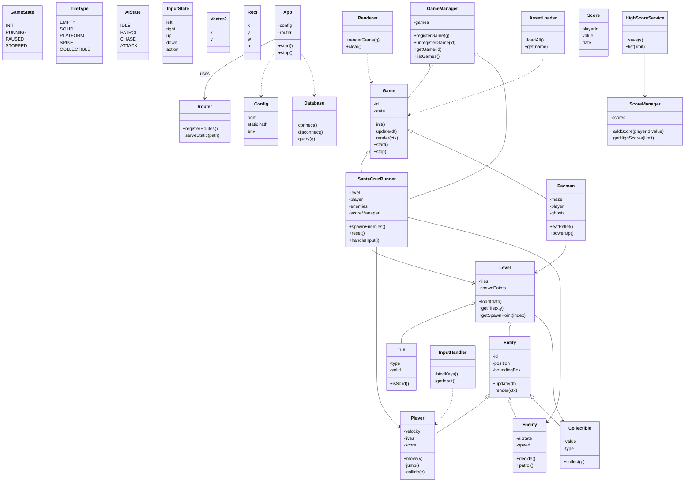
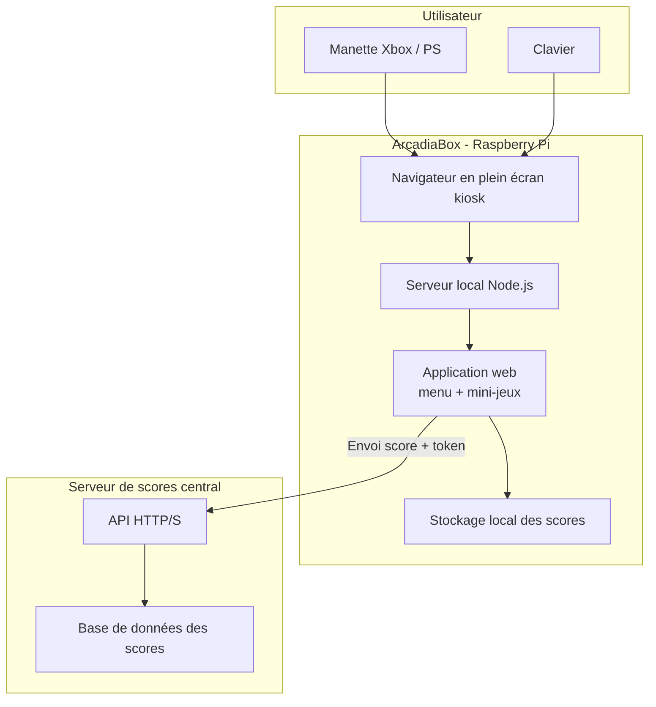
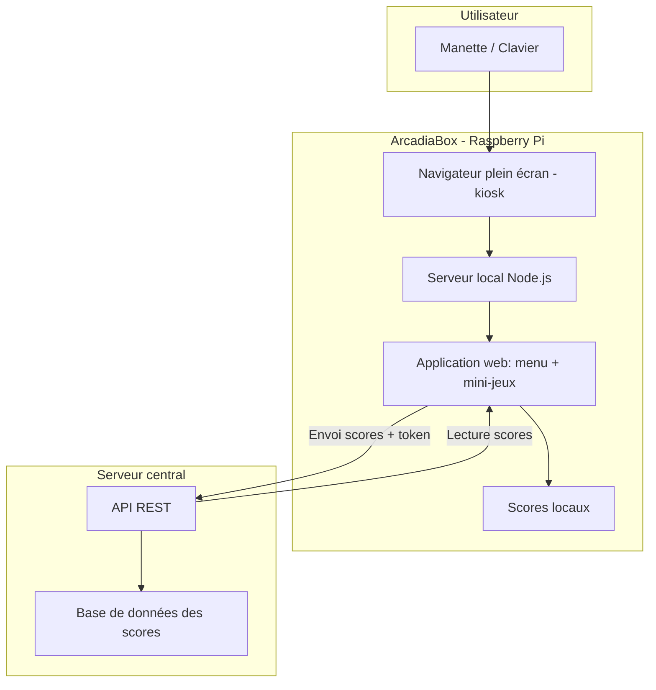

# Diagramme de classes — Projet 306

```mermaid
classDiagram
    %% Enums / simple types
    class GameState {
        INIT
        RUNNING
        PAUSED
        STOPPED
    }
    class TileType {
        EMPTY
        SOLID
        PLATFORM
        SPIKE
        COLLECTIBLE
    }
    class AIState {
        IDLE
        PATROL
        CHASE
        ATTACK
    }
    class InputState {
        left
        right
        up
        down
        action
    }
    class Vector2 {
        x
        y
    }
    class Rect {
        x
        y
        w
        h
    }

    %% Server
    class App {
        -config
        -router
        +start()
        +stop()
    }
    class Router {
        +registerRoutes()
        +serveStatic(path)
    }
    class Config {
        port
        staticPath
        env
    }
    class Database {
        +connect()
        +disconnect()
        +query(q)
    }
    App --> Router : uses
    App ..> Config
    App ..> Database

    %% Core / Manager
    class Game {
        -id
        -state
        +init()
        +update(dt)
        +render(ctx)
        +start()
        +stop()
    }
    class GameManager {
        -games
        +registerGame(g)
        +unregisterGame(id)
        +getGame(id)
        +listGames()
    }
    GameManager o-- Game

    %% Games
    class SantaCruzRunner {
        -level
        -player
        -enemies
        -scoreManager
        +spawnEnemies()
        +reset()
        +handleInput(i)
    }
    class Pacman {
        -maze
        -player
        -ghosts
        +eatPellet()
        +powerUp()
    }
    Game <|-- SantaCruzRunner
    Game <|-- Pacman

    %% World / Level
    class Level {
        -tiles
        -spawnPoints
        +load(data)
        +getTile(x,y)
        +getSpawnPoint(index)
    }
    class Tile {
        -type
        -solid
        +isSolid()
    }
    Level o-- Tile
    SantaCruzRunner --> Level
    Pacman --> Level

    %% Entities
    class Entity {
        -id
        -position
        -boundingBox
        +update(dt)
        +render(ctx)
    }
    class Player {
        -velocity
        -lives
        -score
        +move(v)
        +jump()
        +collide(e)
    }
    class Enemy {
        -aiState
        -speed
        +decide()
        +patrol()
    }
    class Collectible {
        -value
        -type
        +collect(p)
    }
    Entity <|-- Player
    Entity <|-- Enemy
    Entity <|-- Collectible
    Level o-- Entity

    %% IO / Rendering / Input / Assets
    class Renderer {
        +renderGame(g)
        +clear()
    }
    class InputHandler {
        +bindKeys()
        +getInput()
    }
    class AssetLoader {
        +loadAll()
        +get(name)
    }
    Renderer ..> Game
    InputHandler ..> Player
    AssetLoader ..> Game

    %% Persistence
    class Score {
        playerId
        value
        date
    }
    class ScoreManager {
        -scores
        +addScore(playerId,value)
        +getHighScores(limit)
    }
    class HighScoreService {
        +save(s)
        +list(limit)
    }
    HighScoreService --> ScoreManager

    %% Extras
    GameManager o-- SantaCruzRunner
    SantaCruzRunner --> Player
    SantaCruzRunner --> Enemy
    Level --> Collectible
```

```mermaid
graph TD
subgraph U[Utilisateur]
  Gamepad[Manette Xbox / PS]
  Keyboard[Clavier]
end
subgraph Borne[ArcadiaBox - Raspberry Pi]
  Browser[Navigateur en plein écran kiosk]
  LocalServer[Serveur local Node.js]
  App[Application web<br/>menu + mini-jeux]
  LocalScores[Stockage local des scores]
end
subgraph ScoreServer[Serveur de scores central]
  API[API HTTP/S]
  DB[Base de données des scores]
end
Gamepad --> Browser
Keyboard --> Browser
Browser --> LocalServer
LocalServer --> App
App --> LocalScores
App -->|Envoi score + token| API
API --> DB
```

```mermaid
graph TD

%% ==== UTILISATEUR ====
subgraph U[Utilisateur]
  Gamepad[Manette / Clavier]
end

%% ==== BORNE ARCADIABOX ====
subgraph Borne[ArcadiaBox - Raspberry Pi]
  Browser["Navigateur plein écran - kiosk"]
  LocalServer[Serveur local Node.js]
  App[Application web: menu + mini-jeux]
  LocalScores[Scores locaux]
end

%% ==== SERVEUR CENTRAL ====
subgraph ScoreServer[Serveur central]
  API[API REST]
  DB[Base de données des scores]
end

%% ==== FLUX UTILISATEUR ====
Gamepad --> Browser

%% ==== SUR LA BORNE ====
Browser --> LocalServer
LocalServer --> App
App --> LocalScores

%% ==== COMMUNICATION AVEC LE SERVEUR CENTRAL ====
App -->|Envoi scores + token| API
API --> DB
API -->|Lecture scores| App

```